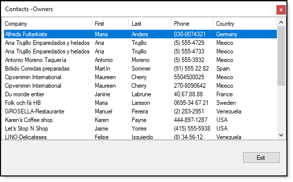

# Basic ListView: DetailView with SQL-Server

TODO



Underlying SELECT statement which filters to one contact type.
```sql
SELECT Cust.CustomerIdentifier, 
        Cust.CompanyName, 
        cont.FirstName, 
        cont.LastName, 
        PT.PhoneTypeDescription, 
        CCD.PhoneNumber, 
        Countries.CountryName, 
        PT.PhoneTypeIdenitfier, 
        Countries.id, 
        cont.ContactIdentifier , 
        CCD.Identifier
FROM Customers AS Cust
        INNER JOIN Contact AS cont ON Cust.ContactIdentifier = cont.ContactIdentifier
        INNER JOIN ContactContactDevices AS CCD ON cont.ContactIdentifier = CCD.ContactIdentifier
        INNER JOIN PhoneType AS PT ON CCD.PhoneTypeIdenitfier = PT.PhoneTypeIdenitfier
        INNER JOIN Countries ON Cust.CountryIdentfier = Countries.id
WHERE Cust.ContactTypeIdentifier = 7
ORDER BY Cust.CompanyName;
```
### Code to populate

TODO