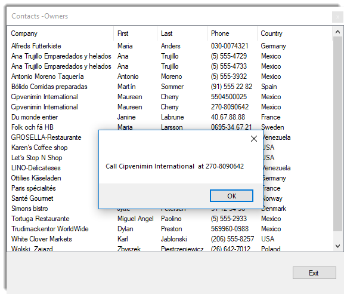
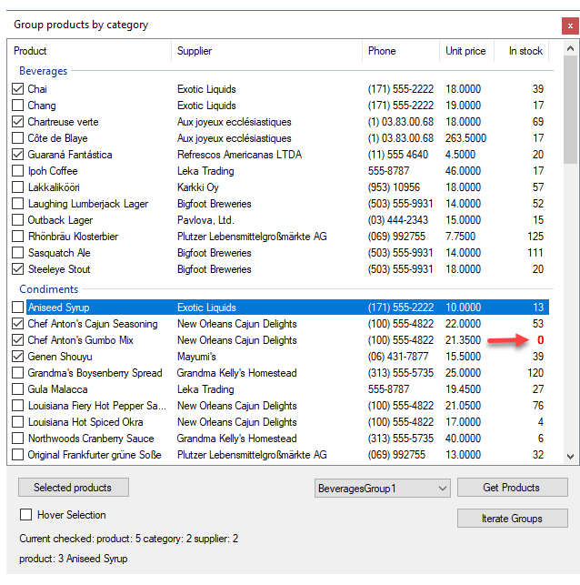
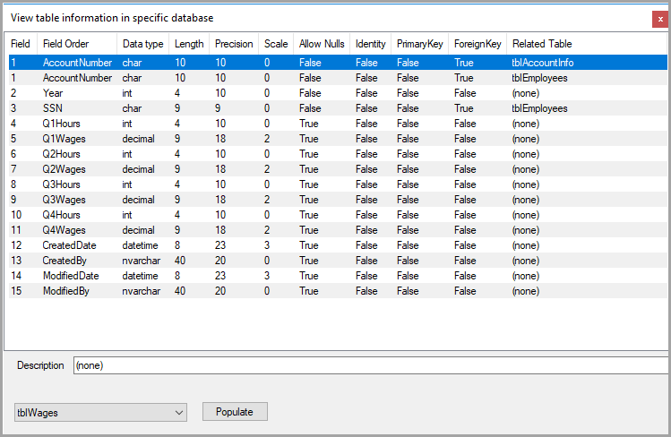

# Working with ListView in Windows Forms


Although Microsoft documentation for the ListView class is well written along with many code snippets on the Internet there are no well-rounded code samples to follow for populating a ListView control from start to finish reading from a data source.  


The following C# code samples provide guidance to populate a ListView from both SQL-Server database table and Json files. Focus is on working with ListView control in Details view, ListView Groups and checked rows.

## Basic setting: ListView control at design time

With a Window form selected and the Toolbox visible double click on a ListView, resize the ListView to accommodate data intended to populate the ListView. On the top right-hand corner of the ListView single click the chevron. From the view dropdown select Details. Click “Edit columns”. For each item .e.g. first name, last name click the “Add” button, name the column e.g. FirstNameColumn, set the Text property e.g. First Name, when done press OK. Don’t be concerned with column width at this time, this will be done later.


## Basic detail view: Contacts Example

Create a class which represents data read from a database table. In the following example customer contacts of type owner will be the target for the first example. This class is a partial representation of several joined tables.

```csharp
public class Contact
{
    public int CustomerIdentifier { get; set; }
    public string CompanyName { get; set; }
    public string FirstName { get; set; }
    public string LastName { get; set; }
    public string PhoneTypeDescription { get; set; }
    public string PhoneNumber { get; set; }
    public string CountryName { get; set; }
    public string[] ItemArray => new[]
    {
        CompanyName,
        FirstName,
        LastName,
        PhoneNumber,
        CountryName
    };
}
```

The ItemArray property will be used to add items to the ListView as the Add method accepts an array of items. The follow method is in a class solely responsible for reading data from a SQL-Server database.


> **Note**
> that the WHERE condition is hard coded, this could be rigged up to accept a int parameter to represent the contact type.


```csharp
public List<Contact> GetOwnerContacts()
{
    mHasException = false;
    var ownerContacts = new List<Contact>();
 
 
    var selectStatement =
        @"
        SELECT   Cust.CustomerIdentifier ,
                 Cust.CompanyName ,
                 cont.FirstName ,
                 cont.LastName ,
                 PT.PhoneTypeDescription ,
                 CCD.PhoneNumber ,
                 Countries.CountryName
        FROM     Customers AS Cust
                 INNER JOIN dbo.Contact AS cont ON Cust.ContactIdentifier =
                    cont.ContactIdentifier
                 INNER JOIN dbo.ContactContactDevices AS CCD ON cont.ContactIdentifier =
                    CCD.ContactIdentifier
                 INNER JOIN dbo.PhoneType AS PT ON CCD.PhoneTypeIdenitfier =
                    PT.PhoneTypeIdenitfier
                 INNER JOIN dbo.Countries ON Cust.CountryIdentfier = Countries.id
        WHERE    ( Cust.ContactTypeIdentifier = 7 )
        ORDER BY Cust.CompanyName;";
 
 
    using (var cn = new SqlConnection() { ConnectionString = ConnectionString })
    {
        using (var cmd = new SqlCommand() { Connection = cn })
        {
            try
            {
                cn.Open();
 
                cmd.CommandText = selectStatement;
 
                var reader = cmd.ExecuteReader();
                while (reader.Read())
                {
                    ownerContacts.Add(new Contact()
                    {
                        CustomerIdentifier = reader.GetInt32(0),
                        CompanyName = reader.GetString(1),
                        FirstName = reader.GetString(2),
                        LastName = reader.GetString(3),
                        PhoneTypeDescription = reader.GetString(4),
                        PhoneNumber = reader.GetString(5),
                        CountryName = reader.GetString(6)
                    }) ;
                }
 
            }
            catch (Exception e)
            {
                mHasException = true;
                mLastException = e;
            }
        }
    }
 
    return ownerContacts;
}
```

In the form with the ListView, in form shown event a new instance of the data class is created followed by call the method above. To ensure that any screen updates are not shown (from adding and resizing columns) BeginUpdate is invoked before adding items to the ListView. If there is a chance of a runtime exception the code between BeginUpDate and the line above EndUpdate may be wrapped in a try-finally statement so that the ListView is partly populated is in working order although the ListView may be unstable so better to prevent any other operations to proceed as seen fit.


```csharp
private void Form1_Shown(object sender, EventArgs e)
{
    var dataOperations = new SqlInformation();
    var contacts = dataOperations.GetOwnerContacts();
 
    ownerContactListView.BeginUpdate();
    foreach (var contact in contacts)
    {
 
        ownerContactListView.Items.Add(
            new ListViewItem(contact.ItemArray)
            {
                Tag = contact.CustomerIdentifier
            });
 
    }
 
    ownerContactListView.AutoResizeColumns(ColumnHeaderAutoResizeStyle.HeaderSize);
    ownerContactListView.EndUpdate();
 
    ownerContactListView.FocusedItem = ownerContactListView.Items[0];
    ownerContactListView.Items[0].Selected = true;
    ActiveControl = ownerContactListView;
 
}
```

During the iteration of contacts a new row is added to the ListView using an overload which accepts an object array which is possible using the Contact ItemArray method. Rather then create an instance of a ListViewItem as a variable and then passing the variable to the Add method it's more efficient to simple add the item directly in the add method. The Tag property is set to the primary key of the contact which is available later to get more information from the database tables. In the following code sample the Tag property for the current item is cast to a integer which can be used to reference back to the table customers.

```csharp
var id = Convert.ToInt32(ownerContactListView.SelectedItems[0]
    .Tag
    .ToString());
```

Sizing of columns is performed using the following line which sizes per data which has been added to the ListView.

```csharp
ownerContactListView.AutoResizeColumns(ColumnHeaderAutoResizeStyle.HeaderSize);
```

To get details for the current ListView Item, in this case the ListView MouseDoubleClick event. The contact and phone will be displayed in a message dialog.

```csharp
private void ListView1_MouseDoubleClick(object sender, MouseEventArgs e)
{
    MessageBox.Show(
        $"Call {ownerContactListView.SelectedItems[0].Text} at " +
        $"{ownerContactListView.SelectedItems[0].SubItems[3].Text}");
}
```



## Basic Detail view with grouping: Products/Category example

In a conventional view for selecting products a DataGridView is used with a filtering mechanism to show one category at a time while an alternate approach would be to group products by category which a standard DataGridView is not capable of without a fair amount of custom coding or a third party grid control. A ListView is the perfect fit when multiple groups (or in this case categories) need to be displayed together.


**Step 1: Obtain items which represent groups**

This demonstration groups products by categories. The following class is used to create a list for working with groups.


```csharp
public class Category
{
    public int CategoryId { get; set; }
    public string Name { get; set; }
    public override string ToString()
    {
        return Name;
    }
}
```

In the form shown event the data class is created and a call is made to obtain categories.

```csharp
var dataOperations = new SqlInformation();
var categories = dataOperations.Categories();
```

Code to obtain categories from a database table.

```csharp
public List<Category> Categories()
{
    mHasException = false;
 
    var categoryList = new List<Category>();
    var selectStatement = "SELECT CategoryID,CategoryName FROM dbo.Categories";
 
    using (var cn = new SqlConnection() {ConnectionString = ConnectionString})
    {
        using (var cmd = new SqlCommand() {Connection = cn})
        {
            cmd.CommandText = selectStatement;
            try
            {
                cn.Open();
                var reader = cmd.ExecuteReader();
                while (reader.Read())
                {
                    categoryList.Add(new Category()
                    {
                        CategoryId = reader.GetInt32(0),
                        Name = reader.GetString(1)
                    });
                }
            }
            catch (Exception e)
            {
                mHasException = true;
                mLastException = e;
            }
        }
    }
 
    return categoryList;
}
```

**Step 2: Populate ListView**

For each category products for the current category are read from the database tables using the following method in the data class.

```csharp
public List<Product> Products(int pIdentifier)
{
    mHasException = false;
 
    var productList = new List<Product>();
 
    var selectStatement =
        @"
        SELECT   P.ProductID ,
                 P.ProductName ,
                 P.SupplierID ,
                 S.CompanyName AS Supplier ,
                 S.Phone ,
                 P.CategoryID ,
                 P.UnitPrice ,
                 P.UnitsInStock
        FROM     dbo.Products AS P
                 INNER JOIN dbo.Suppliers AS S ON P.SupplierID = S.SupplierID
        WHERE    P.CategoryID = @CategoryIdentifier
        ORDER BY P.ProductName;";
 
    using (var cn = new SqlConnection() {ConnectionString = ConnectionString})
    {
        using (var cmd = new SqlCommand() {Connection = cn})
        {
            cmd.CommandText = selectStatement;
            cmd.Parameters.AddWithValue("@CategoryIdentifier", pIdentifier);
 
            try
            {
                cn.Open();
                var reader = cmd.ExecuteReader();
                while (reader.Read())
                {
 
                    productList.Add(new Product()
                    {
                        ProductId = reader.GetInt32(0),
                        ProductName = reader.GetString(1),
                        SupplierId = reader.GetInt32(2),
                        Supplier = reader.GetString(3),
                        Phone = reader.GetString(4),
                        CategoryId = reader.GetInt32(5),
                        UnitPrice = reader.GetDecimal(6),
                        UnitsInStock = reader.GetInt16(7)
                    });
 
                }
            }
            catch (Exception e)
            {
                mHasException = true;
                mLastException = e;
            }
        }
    }
 
    return productList;
}
```

Definition of the Product class.

```csharp
public class Product
{
    public int ProductId { get; set; }
    public string ProductName { get; set; }
    public int SupplierId { get; set; }
    public string Supplier { get; set; }
    public string Phone { get; set; }
    public int CategoryId { get; set; }
    public decimal? UnitPrice { get; set; }
    public int UnitsInStock { get; set; }
    /// <summary>
    /// Container for ListView item to store primary keys
    /// </summary>
    public ProductTag IdentifiersTag => new ProductTag()
    {
        CategoryId = CategoryId,
        SupplierId = SupplierId,
        ProductId = ProductId
    };
 
    public override string ToString()
    {
        return $"{ProductName}";
    }
}
```

Note IdentifiersTag property contains primary and foreign keys for use later if needed to query for more information of fields not obtained in the read operation above or for when edits are needed.

```csharp
public class ProductTag
{
    public int ProductId { get; set; }
    public int SupplierId { get; set; }
    public int CategoryId { get; set; }
}
```

Once products have been returned from the database a name is composed for the current group which becomes the name of the group (ListViewGroup) along with a indexer to keep group names unique.  Unlike the first example which used an array to populate a list item this example sets each sub-item directly in the constructor for adding a new item along with assigning the group and within the Tag property keys for referencing back to the tables in the database.

For some simple formatting if a product has nothing in stock the units in stock has a foreground color of bold red. Finally the list item is added to the ListView.

```csharp
private void Form1_Shown(object sender, EventArgs e)
{
    var dataOperations = new SqlInformation();
    var categories = dataOperations.Categories();
 
    var categoryIndex = 1;
 
    // ReSharper disable once TooWideLocalVariableScope
    var groupName = "";
 
    foreach (var category in categories)
    {
        var products = dataOperations.Products(category.CategoryId);
 
        /*
         * Some category names have unwanted characters and/or whitespace, remove these chars.
         */
        groupName = category.Name.Replace("/", "").Replace(" ", "");
 
        var currentGroup = new ListViewGroup(category.Name, HorizontalAlignment.Left)
        {
            Header = category.Name,
            Name = $"{groupName}Group{categoryIndex}"                   
        };
 
        categoryIndex += 1;
 
        ProductListView.Groups.Add(currentGroup);
 
        foreach (var product in products)
        {
            var listViewProductItem = new ListViewItem(new[]
            {
                product.ProductName,
                product.Supplier,
                product.Phone,
                product.UnitPrice.ToString(),
                product.UnitsInStock.ToString()
            }, -1)
            {
                Group = currentGroup,
                /*
                 * Contains primary and foreign keys for current product
                 */
                Tag = product.IdentifiersTag,
                /*
                 * Required to change font and ForeColor below
                 */
                UseItemStyleForSubItems = false
            };
 
 
            /*
             * Alter user that the product is not available.
             * Could have excluded the product, that would be dependent
             * on business requirements. Also reorder information could
             * be presented.
             */
            if (product.UnitsInStock == 0)
            {
                listViewProductItem.SubItems[4].ForeColor = Color.Red;
 
                listViewProductItem.SubItems[4].Font = new Font(
                    listViewProductItem.SubItems[4].Font.FontFamily,
                    listViewProductItem.SubItems[4].Font.Size, FontStyle.Bold);
 
            }
 
            ProductListView.Items.Add(listViewProductItem);
        }
    }
 
    ProductListView.FocusedItem = ProductListView.Items[0];
    ProductListView.Items[0].Selected = true;
 
    ActiveControl = ProductListView;
 
    ProductListView.ItemSelectionChanged += ProductListView_ItemSelectionChanged;
    ProductListView.ItemCheck += ProductListView_ItemCheck;
 
    GroupsComboBox.DataSource = ProductListView.Groups.Cast<ListViewGroup>().Select(lvg => lvg.Name).ToList();
}
```

Once all items have been added the first item is focused.

Screenshot



## Checked rows

To add check boxes, select the ListView, select properties, find CheckBoxes and set to true. 

**Iterate checked rows**

For this example the code is in a button click which writes results to the IDE output window while in a production all there would be a list to pass to business logic for processing.

```csharp
/// <summary>
/// Demonstration for iterating a single ListViewGroup
/// by group name in ComboBox
/// </summary>
/// <param name="sender"></param>
/// <param name="e"></param>
private void GetGroupProductsButton_Click(object sender, EventArgs e)
{
    var specificGroup = ProductListView.Groups.Cast<ListViewGroup>()
        .FirstOrDefault(lvg => lvg.Name == GroupsComboBox.Text);
 
    for (int index = 0; index < specificGroup.Items.Count; index++)
    {
        var productTag = specificGroup.Items[index].ProductTag();              
        Console.WriteLine($"Id: {productTag.ProductId} Product: {specificGroup.Items[index].Text}");
    }
}
```

Take note on var productTag = specificGroup.Items[index].ProductTag(); where ProductTag is a language extension method within the current project. This keeps the cast process out of sight for cleaner code in the form.

```csharp
using System.Windows.Forms;
using SqlServerOperations.Classes;
 
namespace BasicListViewGroupsExample.LanguageExtensions
{
    /// <summary>
    /// Contains project specific extension methods
    /// </summary>
    public static class ListViewExtensions
    {
        /// <summary>
        /// Get primary and foreign keys for a product
        /// within a ListView
        /// </summary>
        /// <param name="sender"></param>
        /// <returns></returns>
        public static ProductTag ProductTag(this ListViewItem sender)
        {
            return (ProductTag) sender.Tag;
        }
    }
}
```

Another place the extension method is useful for is when traversing rows in the ListView, here other details may be obtained using the keys stored in the current item tag property. Here keys are simply displayed in labels.

```csharp
private void ProductListView_ItemSelectionChanged(object sender, ListViewItemSelectionChangedEventArgs e)
{
    if (e.IsSelected)
    {
        var primaryKeys = e.Item.ProductTag();
        SelectionChangedLabel.Text =
            $"product: {primaryKeys.ProductId} " +
            $"{ProductListView.Items[e.ItemIndex].Text}";
    }
}
```

The following code shows how to collect checked row items into a child form.

```csharp
private void SelectedProductsButton_Click(object sender, EventArgs e)
{
    var checkedItems = ProductListView.CheckedItems;
 
    if (checkedItems.Count > 0)
    {
        var sb = new StringBuilder();
 
        for (int index = 0; index < checkedItems.Count; index++)
        {
            var keys = checkedItems[index].ProductTag();
 
            sb.AppendLine(
                $"{keys.CategoryId}," +
                $"{checkedItems[index].Group.Header}," +
                $"{keys.ProductId}," +
                $"{checkedItems[index].Text}," +
                $"{keys.SupplierId}," +
                $"{checkedItems[index].SubItems[0].Text}");
        }
 
        /*
         * Show selected products, in a real application this data
         * would be sent to a method to process the products
         */
 
        var f = new SelectedProductsForm(sb.ToString());
 
        try
        {
            f.ShowDialog();
        }
        finally
        {
            f.Dispose();
        }
    }
    else
    {
        MessageBox.Show("No product(s) selected");
    }
}
```


## Other examples

### SQL-Server table columns and related tables

In the following example which follows the same code paths as the examples shown above a ListView is setup for displaying table column definitions and related tables.



The following class is responsible for table information.


```csharp
public class ServerTableItem
{
    public string Table { get; set; }
    public string Field { get; set; }
    public Int16? FieldOrder { get; set; }
    public string DataType { get; set; }
    public Int16? Length { get; set; }
    public string Precision { get; set; }
    public Int32 Scale { get; set; }
    public string AllowNulls { get; set; }
    public string Identity { get; set; } = String.Empty;
    public string PrimaryKey { get; set; }
    public string ForeignKey { get; set; } = String.Empty;
    public string RelatedTable { get; set; }
    public string Description { get; set; }
    public override string ToString()
    {
        return Field;
    }
}
```

**Warning for novice coders**: Reading information is rather complicated!!!

- Using the SQL statement below, data is read into a DataTable
- Using Lambda group statement tables columns are grouped together by table name into an anonymous type.
- The result set above is iterated over and items are placed into a Dictionary of Dictionary&lt;string, List&lt;ServerTableItem>>

Method which returns table information explained above.

```csharp
public Dictionary<string, List<ServerTableItem>> TableDependencies()
{
    mHasException = false;
 
    var informationTable = new DataTable();
 
    var selectStatement = @"
        SELECT  syso.name [Table],
                sysc.name [Field],
                sysc.colorder [FieldOrder],
                syst.name [DataType],
                sysc.[length] [Length],
                CASE WHEN sysc.prec IS NULL THEN 'NULL' ELSE CAST(sysc.prec AS VARCHAR) END [Precision],
        CASE WHEN sysc.scale IS null THEN '-' ELSE sysc.scale END [Scale],
        CASE WHEN sysc.isnullable = 1 THEN 'True' ELSE 'False' END [AllowNulls],
        CASE WHEN sysc.[status] = 128 THEN 'True' ELSE 'False' END [Identity],
        CASE WHEN sysc.colstat = 1 THEN 'True' ELSE 'False' END [PrimaryKey],
        CASE WHEN fkc.parent_object_id is NULL THEN 'False' ELSE 'True' END [ForeignKey],
        CASE WHEN fkc.parent_object_id is null THEN '(none)' ELSE obj.name  END [RelatedTable],
        CASE WHEN ep.value is NULL THEN '(none)' ELSE CAST(ep.value as NVARCHAR(500)) END [Description]
        FROM [sys].[sysobjects] AS syso
        JOIN [sys].[syscolumns] AS sysc on syso.id = sysc.id
        LEFT JOIN [sys].[systypes] AS syst ON sysc.xtype = syst.xtype and syst.name != 'sysname'
        LEFT JOIN [sys].[foreign_key_columns] AS fkc on syso.id = fkc.parent_object_id and
            sysc.colid = fkc.parent_column_id   
        LEFT JOIN [sys].[objects] AS obj ON fkc.referenced_object_id = obj.[object_id]
        LEFT JOIN [sys].[extended_properties] AS ep ON syso.id = ep.major_id and sysc.colid =
            ep.minor_id and ep.name = 'MS_Description'
        WHERE syso.type = 'U' AND  syso.name != 'sysdiagrams'
        ORDER BY [Table], FieldOrder, Field;";
 
    using (var cn = new SqlConnection() {ConnectionString = ConnectionString})
    {
        using (var cmd = new SqlCommand() {Connection = cn})
        {
            cmd.CommandText = selectStatement;
 
            try
            {
 
                cn.Open();
 
                informationTable.Load(cmd.ExecuteReader());
            }
            catch (Exception e)
            {
                mHasException = true;
                mLastException = e;
            }
 
        }
    }
 
    var result = from row in informationTable.AsEnumerable()
        group row by row.Field<string>("Table") into grp
        select new
        {
            TableName = grp.Key,
            Rows = grp,
            Count = grp.Count()
        };
 
    var tableDictionary = new Dictionary<string, List<ServerTableItem>>();
 
    foreach (var topItem in result)
    {
 
        if (!tableDictionary.ContainsKey(topItem.TableName))
        {
            tableDictionary[topItem.TableName] = new List<ServerTableItem>();
        }
 
        foreach (var row in topItem.Rows)
        {
            tableDictionary[topItem.TableName].Add(new ServerTableItem()
            {
                Table = topItem.TableName,
                Field = row.Field<string>("Field"),
                FieldOrder = row.Field<short>("FieldOrder"),
                DataType = row.Field<string>("DataType"),
                Length = row.Field<short>("Length"),
                Precision = row.Field<string>("Precision"),
                Scale = row.Field<int>("Scale"),
                AllowNulls = row.Field<string>("AllowNulls"),
                Identity = row.Field<string>("Identity"),
                PrimaryKey = row.Field<string>("PrimaryKey"),
                ForeignKey = row.Field<string>("ForeignKey"),
                RelatedTable = row.Field<string>("RelatedTable"),
                Description = row.Field<string>("Description")
            });
        }
    }
 
    return tableDictionary;
}
```

The Dictionary returned above is set to a ComboBox data source where a BindingSource is required as a ComboBox.DataSource does not handle dictionaries.

```csharp
private void Form1_Shown(object sender, EventArgs e)
{
    var items = _tableInformation.TableDependencies();
    tableInformationComboBox.DataSource = new BindingSource(items, null);
    tableInformationComboBox.DisplayMember = "Key";
}
```


When a selection is made from the ComboBox, clicking the associated button populates the ListView using a more drawn out method by adding SubItems rather than using an array to setup a ListViewItem.

Once the load process has completed the first item is selected followed by painting alternate rows in a light grey.

```csharp
private void GetInformationButton_Click(object sender, EventArgs e)
{
    listView1.Items.Clear();
 
    var detailItems = ((KeyValuePair<string, List<ServerTableItem> >)
        tableInformationComboBox.SelectedItem);
 
    foreach (var serverTableItem in detailItems.Value)
    {
        var item = listView1.Items.Add(serverTableItem.FieldOrder.ToString());
        item.SubItems.Add(serverTableItem.Field);
        item.SubItems.Add(serverTableItem.DataType);
        item.SubItems.Add(serverTableItem.Length.ToString());
        item.SubItems.Add(serverTableItem.Precision);
        item.SubItems.Add(serverTableItem.Scale.ToString());
        item.SubItems.Add(serverTableItem.AllowNulls);
        item.SubItems.Add(serverTableItem.Identity);
        item.SubItems.Add(serverTableItem.PrimaryKey);
        item.SubItems.Add(serverTableItem.ForeignKey);
        item.SubItems.Add(serverTableItem.RelatedTable);
 
        item.Tag = serverTableItem.Description;
    }
 
    listView1.AutoResizeColumns(ColumnHeaderAutoResizeStyle.HeaderSize);
    listView1.FocusedItem = listView1.Items[0];
    listView1.Items[0].Selected = true;
    ActiveControl = listView1;
 
    /*
     * Shade alternate rows
     */
    var index = 0;
    var shadedBackgroundColor = Color.FromArgb(240, 240, 240);
 
    foreach (ListViewItem item in listView1.Items)
    {
        if (index++ % 2 != 1) continue;
        item.BackColor = shadedBackgroundColor;
        item.UseItemStyleForSubItems = true;
    }
}
```

## Working with moving rows up/down

DEV article [Windows form move items up/down in ListView and more](https://dev.to/karenpayneoregon/windows-form-move-items-updown-in-listview-and-more-5gp7)


## Summary

This article has presented the basics for adding items to a ListView from database tables and Json for detail view using groups and check boxes for learning how to do this in Windows Forms projects.

All projects were written with Framework 4.7 and to show how well code was written the author of this article duplicated BasicListViewGroupsExample project and ported to BasicListViewGroupsExampleCore.

Steps

- Open each form one by one in BasicListViewGroupsExample, copied designer code.
- Commented out event handlers when pasting code into BasicListViewGroupsExampleCore forms.
- Took SQL from the old project, placed them into the new projects
    - Replaced connection and command objects with Dapper
- All code worked in the forms but made minor changes to enhance your learning expereince.

