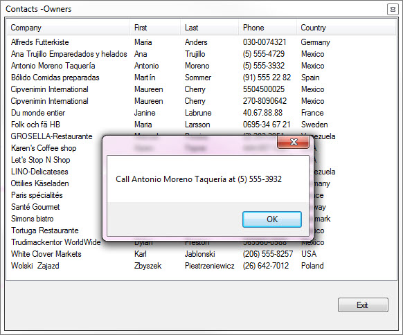
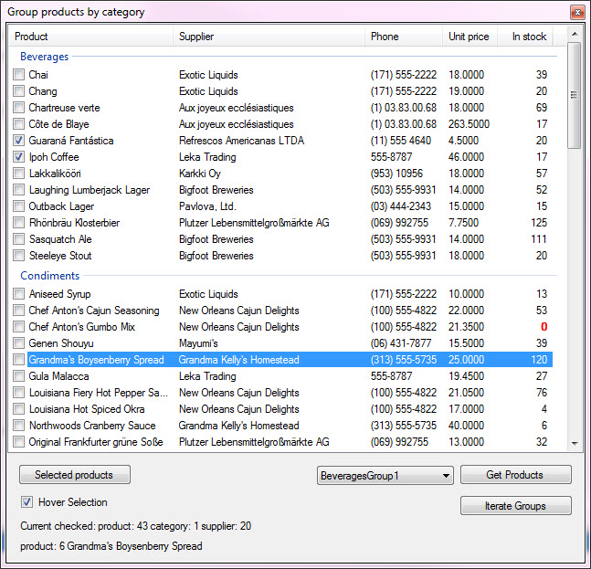
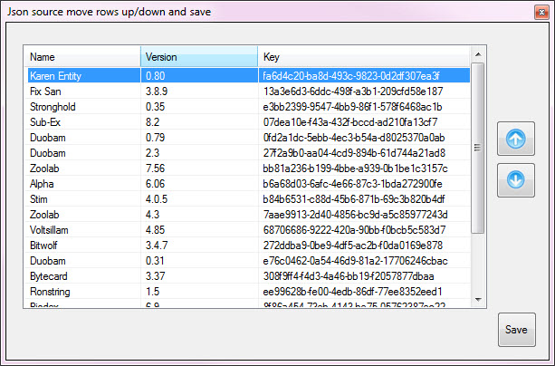
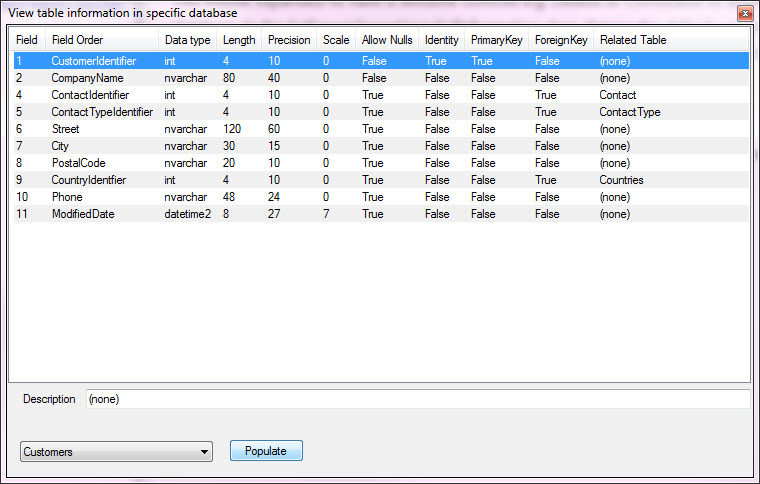

## Old readme

For The following [TechNet article](https://social.technet.microsoft.com/wiki/contents/articles/53356.windows-forms-listview-examining-detail-view-with-sql-server.aspx).

## Basic

## Grouping

## Move item up/down

## Working with SQL-Server

